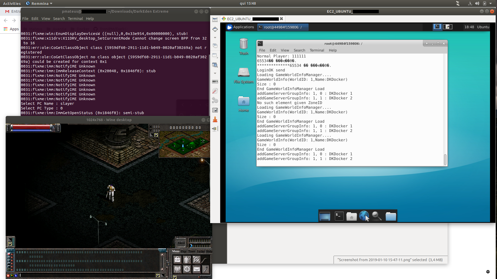

# DarkEden Client on Linux with WINE
Run your darkeden client on linux.

Copy ```start.sh``` to your client folder and give permissions:
```sh
$ chmod +x start.sh
```

And just run (sudo password will be asked because winehq and mono-complete will be installed):
```sh
./start.sh
```

 # Screenshot
 
 
 # TO-DO
 Yea, man, i know. This text is a mess. Try to fix this asap (maybe with https://forum.winehq.org/viewtopic.php?t=919).
